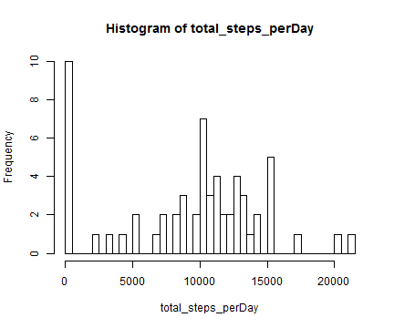
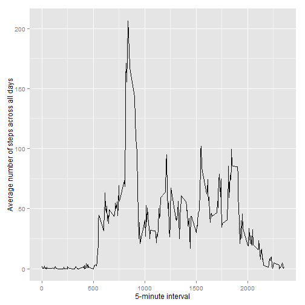
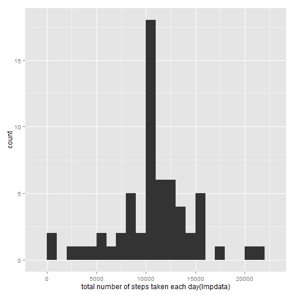
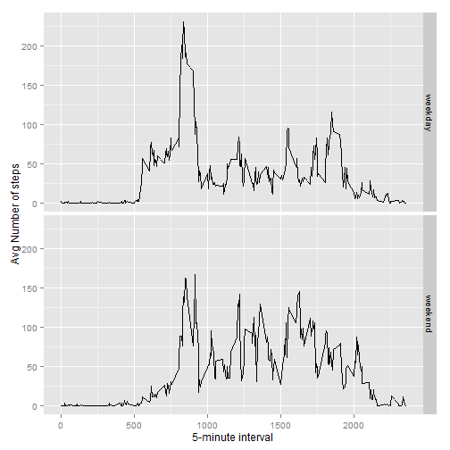

# Ativity Monitoring device

## 1) Loading and preprocessing the data

```r
unzip(zipfile = "activity.zip")
data <- read.csv("activity.csv")
```

## 2) What is mean total number of steps taken per day?

2.1 Remove NA and count total number of steps per day and plot them in Histogram

```r
total_steps_perDay <- tapply(data$steps, data$date, FUN = sum, na.rm = TRUE) 
hist(total_steps_perDay, breaks=50)
```

 

2.2 Calculate and report the mean and median of the total number of steps taken per day

```r
mean(total_steps_perDay,na.rm= "true")   
```

```
## [1] 9354.23
```

```r
median(total_steps_perDay,na.rm= "true")  
```

```
## [1] 10395
```
  

## 3) What is the average daily activity pattern?
3.1 Make a time series plot (i.e. type = "l") of the 5-minute interval (x-axis) and the average number of steps taken, averaged across all days (y-axis) 

```r
library(ggplot2)
aveStepInt <- aggregate(x = list(steps = data$steps), by = list(interval = data$interval), mean, na.rm = TRUE)
ggplot(data = aveStepInt, aes(x = interval, y = steps)) + geom_line() + xlab("5-minute interval") +  ylab("Average number of steps across all days")
```

 
3.2 Which 5-minute interval, on average across all the days in the dataset, contains the maximum number of steps?

```r
aveStepInt[which.max(aveStepInt$steps),]
```

```
##     interval    steps
## 104      835 206.1698
```
## 4) Imputing missing values   
4.1 Calculate and report the total number of missing values in the dataset i.e. the total number of rows with NAs  2304 val


```r
nrow(data[is.na(data$steps),])
```

```
## [1] 2304
```

4.2 Create a new dataset that is equal to the original dataset but with the missing data  (mean) filled in and make histogram on imputed data total number of steps on each day

```r
impdata<-data
### Wrong value impdata[is.na(data)]<- stepmean
impdata <- data
for (i in 1:nrow(data)){
if (is.na(impdata[i,1])){ impdata[i,1] <- (aveStepInt[aveStepInt$interval==impdata[i,3], "steps"])}
}    

imptot_steps <- tapply(impdata$steps, impdata$date, FUN = sum)  
qplot(imptot_steps, binwidth = 1000, xlab = "total number of steps taken each day(Impdata)")
```

 

4.3 Calculate and report the mean and median total number of steps taken per day. Do these values differ from the estimates from the first part of the assignment? What is the impact of imputing missing data on the estimates of the total daily number of steps?

```r
mean(imptot_steps= "true")   
```

```
## Error in mean.default(imptot_steps = "true"): argument "x" is missing, with no default
```

```r
median(imptot_steps,na.rm= "true")  
```

```
## [1] 10766.19
```
The mean and the median total number of steps taken per day are same.    

## 5) Are there differences in activity patterns between weekdays and weekends?
5.1 Create a new factor variable in the dataset with two levels "weekday" and "weekend" indicating whether a given date is a weekday or weekend day.

```r
library(timeDate)
impdata$DateType<-isWeekday(impdata$date, wday = 1:5) 
impdata$DateType[impdata$DateType==FALSE]<- "weekend"
impdata$DateType[impdata$DateType==TRUE]<- "weekday"
table(impdata$DateType)
```

```
## 
## weekday weekend 
##   12960    4608
```
 
5.2 Make a panel plot containing a time series plot (i.e. type = "l") of the 5-minute interval (x-axis) and the average number of steps taken, averaged across all weekday days or weekend days (y-axis). 

```r
impavg <- aggregate(steps ~ interval + DateType, data = impdata, mean)
library(lattice)
ggplot(impavg, aes(interval, steps)) + geom_line() + facet_grid(DateType ~ .) +xlab("5-minute interval") + ylab("Avg Number of steps") 
```

 
